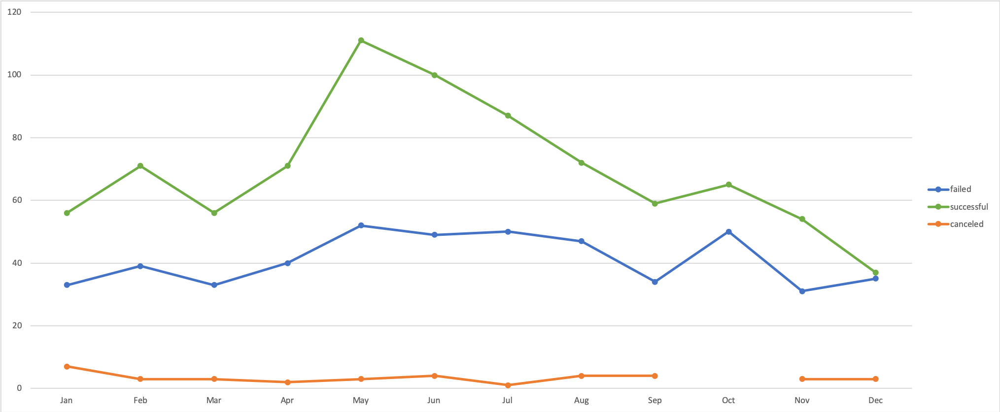

# Kickstarter Campaigns Analysis
An analysis of Kickstarter campaigns sorted and viewed by types, location, success, and monetary values.

A majority of successful theater campaigns in the UK have a goal of less than $2000.

### Challenge
This challenge was to illustrate the success/failure rates of plays and theater Kickstarter projects by performing two analyses. Analyzing the outcomes of play projects by financial goals, and analyzing the outcomes of theater projects by launch date (Theater projects).

Limitations: 
- The analysis was limited to available Kickstarter data. Non Kickstarter fundraising efforts were not included
- Analysis was limited to comparing the outcomes with financial goals and launch dates. Information relating to project information (word count, outlines, timelines, etc.), country of origin, staff pick, and spotlight features were not available or were not relevant to the analysis.

### Outcomes based on goals – Plays

- Play projects were successful greater than 2/3 of the time if the goal was between $0 - $4,999 or between $35,000 - $44,999. New play projects should attempt to keep their financial goals withinin these ranges.
- Goals between $5000 - $24,999 had a roughly even chance of succeeding and failing
- Goals between $25,000 – $34,999 & greater than $49,999 failed more than 73% of the time

### Outcomes based on launch date – Theater

- December has been historically the worst month to Launch a theater project as essentially an even number of project succeeded and failed
- Projects launched in May and June had the highest success rate. Ideally, new theater projects should launch in in these months, or to a lesser extent, July.
- Projects launched in all other months did not show an extensive benefit to their success, compared to projects launched in May and June.

In summary, the ideal Kickstarter play project should have a financial goal of less than $5000 and be launched in May.
